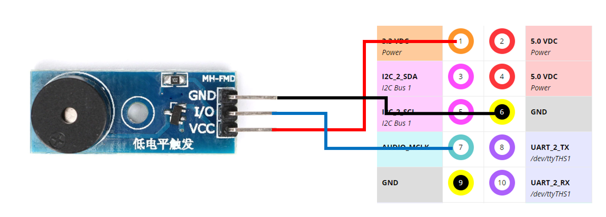

# Edge vs Cloud Computing

---

# Overview

-   Edge Computing Introduction
-   Intro to Jetson-nano, L4T (Linux for Tegra) & JetPack,
-   GPIO Programming & Hardware interfacing (Buzzer & LED)
-   Camera interfacing,

---

## Jetson-nano<br>


-   NVIDIA® Jetson Nano™ Developer Kit is a small, powerful computer that lets you run multiple neural networks in parallel, easy-to-use platform that runs in as little as 5 watts.
-   Feature :
    -   Jetson Nano Module<br>
         - 128-core NVIDIA Maxwell™ GPU - Quad-core ARM® A57 CPU - 4 GB 64-bit LPDDR4 - 10/100/1000BASE-T Ethernet
    -   Power Options
        -   Micro-USB 5V 2A
        -   DC power adapter 5V 4A
    -   I/O<br>
        
        -   USB 3.0 Type A - USB 2.0 Micro-B - HDMI/DisplayPort - M.2 Key E - Gigabit Ethernet - GPIOs, I2C, I2S, SPI, UART - 2xMIPI-CSI camera connector - Fan connector - PoE connector

---

## L4T OS (Linux For Tegra)

-   Linux for Tegra (Linux4Tegra, L4T) is a GNU/Linux based system software distribution by Nvidia for the Nvidia Tegra processor series, used in platforms like the Nvidia Jetson board series. [[wiki](https://en.wikipedia.org/wiki/Linux_for_Tegra)]
-   It includes :
    -   Linux Kernel 4.9,
    -   bootloader,
    -   NVIDIA drivers,
    -   flashing utilities,
    -   sample filesystem based on Ubuntu 18.04,
    -   and more for the Jetson platform
-   Latest release is NVIDIA L4T 32.5, supports all Jetson modules:
    -   Jetson AGX Xavier series,
    -   Jetson Xavier NX,
    -   Jetson TX2 series,
    -   Jetson TX1,
    -   and Jetson Nano
-   Check L4T version used by Jetson Nano using Terminal
    ```
    head -n 1 /etc/nv_tegra_release
    ```
-   Result :
    ```
    # R32 (release), REVISION: 6.1, GCID: 27863751, BOARD: t210ref, EABI: aarch64, DATE: Mon Jul 26 19:20:30 UTC 2021
    ```
-   `R32` and `REVISION: 6.1` in the log above indicates that the L4T version used is L4T 32.6.
-   Check L4T Linux Kernel version,
    ```
    uname -a
    ```
-   Result,
    ```
    Linux jetson-desktop 4.9.253-tegra #1 SMP PREEMPT Mon Jul 26 12:13:06 PDT 2021 aarch64 aarch64 aarch64 GNU/Linux
    ```
-   You can see that the kernel version used is `4.9.253-tegra` for the `aarch64` architecture.

---

## NVIDIA JetPack SDK

-   NVIDIA JetPack SDK is the most comprehensive solution for building AI applications. All Jetson modules and developer kits are supported by JetPack SDK.
-   JetPack SDK includes the latest Linux Driver Package (L4T) with Linux operating system and CUDA-X accelerated libraries and APIs for Deep Learning, Computer Vision, Accelerated Computing and Multimedia. <br>
    

-   Latest release JetPack is version 4.6.
    <br>https://developer.nvidia.com/embedded/jetpack
-   JetPack Feature :
    -   **OS** : NVIDIA L4T (JetPack 4.5 includes L4T 32.5)
    -   **CUDA** : is a parallel computing platform and programming model using a GPU. (JetPack 4.5 include CUDA 10.2 )
    -   **cuDNN** : (CUDA Deep Neural Network) is a GPU-accelerated library of primitives for deep neural networks. Provides highly tuned implementations for standard routines such as _forward_ and _backward convolution_, _pooling_, _normalization_, and _activation layers_. cuDNN accelerates widely used deep learning frameworks, including **Caffe2**, **Chainer**, **Keras**, **MATLAB**, **MxNet**, **PaddlePaddle**, **PyTorch**, and **TensorFlow** (JetPack 4.5 includes cuDNN 8.0).
    -   **TensorRT** : is a high performance deep learning inference runtime, built on top of CUDA (JetPack 4.5 includes TensorRT 7.1.3)
    -   **Computer Vision** :
        -   VisionWorks ver 1.6
        -   **OpenCV** (default without CUDA) ver 4.1.1
        -   VPI (Vision Programing Interface) ver 1.0
-   Check JetPack version in L4T OS,
    ```
    sudo apt-cache show nvidia-jetpack
    ```
-   Result,
    ```
    Package: nvidia-jetpack
    Version: 4.6-b197
    Architecture: arm64
    Maintainer: NVIDIA Corporation
    Installed-Size: 194
    ...
    .
    ```
-   You can see that the JetPack version is `4.5-xxx` in `L4T 32.5` .

---

## Basic Linux Command

-   Update & Upgrade softwre,
    ```
    sudo apt-get update
    sudo apt-get upgrade
    ```
-   Check network interface,
    ```
    ifconfig
    ```
-   Working with Filesystems,

    -   lists the content of the current directory,
        ```
        ls
        ```
    -   listing with detail,
        ```
        ls -lAh
        ```
    -   change/move directory,
        ```
        cd Downloads
        ```
    -   move to home dir,
        ```
        cd ~
        ```
    -   check current working dir,
        ```
        pwd
        ```
    -   create forlder,

        ```
        mkdir Test
        ```

    -   create file,
        ```
        touch myfile.txt
        ```
    -   copy file,
        ```
        cp myfile.txt Test
        ```
    -   remove file,
        ```
        rm Test/myfile.txt
        ```
    -   move file,
        ```
        mv myfile.txt Test
        ```
    -   remove empty folder,
        ```
        rmdir Test
        ```
    -   remove non empty folder,
        ```
        rm -rf Test
        ```

---

## Basic GPIO Programming

-   Jetson Nano GPIO reference,<br>
    
-   Update & Upgrade software,
    ```
    sudo apt-get update && sudo apt-get upgrade
    ```
-   Install Python Library `Jetson.GPIO` (_by default is already installed_),
    ```
    sudo pip install Jetson.GPIO
    ```
-   https://github.com/NVIDIA/jetson-gpio

## 1. Program Blink :

-   Wiring diagram, using **pin 12**.<br>
    
-   Blink program,

    ```python
    import Jetson.GPIO as GPIO
    import time

    # Pin Definitions
    output_pin = 12  # BOARD pin 12

    # Pin Setup:
    GPIO.setmode(GPIO.BOARD)  # BCM pin-numbering scheme from Raspberry Pi
    # set pin as an output pin with optional initial state of HIGH
    GPIO.setup(output_pin, GPIO.OUT, initial=GPIO.HIGH)

    print("Press CTRL+C to exit")

    try:
        while True:
            GPIO.output(output_pin, GPIO.HIGH)
            time.sleep(1)
            GPIO.output(output_pin, GPIO.LOW)
            time.sleep(1)
    finally:
        GPIO.cleanup()
    ```

-   Run program,
    ```
    python '1. blink.py'
    ```
-   Result,<br>
    

## 2. Program Buzzer :

-   Wiring diagram, using **pin 7**.<br>
    
-   Buzzer program,

    ```python
    import Jetson.GPIO as GPIO
    import time

    # Pin Definitions
    output_pin = 7  # BOARD pin 7

    # Pin Setup:
    GPIO.setmode(GPIO.BOARD)
    GPIO.setup(output_pin, GPIO.OUT, initial=GPIO.HIGH)

    print("Press CTRL+C to exit")

    try:
        while True:
            # bep, bep, bep ...
            for _ in range(3):
                GPIO.output(output_pin, GPIO.HIGH)
                time.sleep(0.1)
                GPIO.output(output_pin, GPIO.LOW)
                time.sleep(0.02)
            GPIO.output(output_pin, GPIO.HIGH)
            time.sleep(0.5)

    finally:
        GPIO.output(output_pin, GPIO.HIGH)
        GPIO.cleanup()
    ```

-   Run program,
    ```
    python '2. buzzer.py'
    ```

---

## Camera interfacing

-   List supported camera in Jetson Nano :
    -   https://elinux.org/Jetson_Nano#Cameras
-   Attach camera Board to Jetson Nano :
    -   CSI Camera :<br>
        
    -   USB Webcam :<br>
        
-   Check camera node,
    ```
    ls /dev/video*
    ```
-   result,
    ```
    /dev/video0 /dev/video1
    ```
-   You can see above, we have two attached camera into Jetson Nano,

---

## nvgstcapture

-   The examples below use **nvgstcapture gstreamer application** to access the camera features via the NVIDIA API.

### 1. Start Capture and Preview display on the screen

-   CSI camera
    ```
    nvgstcapture-1.0
    ```
-   USB Camera, capture using node 0,
    ```
    nvgstcapture-1.0 --camsrc=0 --cap-dev-node=0
    ```
-   Press `'j'` to Capture one image.
-   Press `'q'` to exit

### 2. Capture a video and save to disk

-   CSI camera
    ```
    nvgstcapture-1.0
    ```
-   USB Camera, capture using node 0,
    ```
    nvgstcapture-1.0 --mode=2 --camsrc=0 --cap-dev-node=0
    ```
-   Press `'1'` to Start recording video
-   Press `'0'` to Stop recording video
-   Press `'q'` to exit

### GStreamer [GST Pipeline]

-   jika diakses dari ssh perlu menjalankan command berikut pada jetson

    ```
    export DISPLAY=:0.0
    ```

-   CSI camera
    ```
    gst-launch-1.0 nvarguscamerasrc ! 'video/x-raw(memory:NVMM),width=3820, height=2464, framerate=21/1, format=NV12' ! nvvidconv flip-method=0 ! 'video/x-raw,width=960, height=616' ! nvvidconv ! nvegltransform ! nveglglessink -e
    ```

---

## Install Demo NVIDIA

Untuk menjalankan demo project NVIDIA jetson dapat dilakukan dengan langkah-langkah sebagai berikut :

-   Masuk pada directory cuda binary:
    ```
    cd /usr/local/cuda/bin
    ```
-   Lihat daftar file pada direktori tersebut :
    ```
    ls -l
    ```
-   Jalankan script untuk mengcopy data ke home directory

    ```
    ./cuda-install-samples-10.2.sh ~
    ```

-   Kembali ke home directory

    ```
    cd ~
    ```

    

-   Masuk ke directory NVIDIA_CUDA-10.2_Samples
    ```
    cd NVIDIA_CUDA-10.2_Samples/
    ls - l
    ```
-   Compile NVIDIA Cuda sample
    ```
    make -j4
    ```
-   Tunggu hingga proses compile selesai (waktu compile +-20 menit)
-   Masuk ke directory `relase`
    ```
    ~/NVIDIA_CUDA-10.2_Samples/bin/aarch64/linux/release
    ```
-   Jalankan salah satu sample
    ```
    ./smokeParticles
    ```
    

---

## Install Demo VISIONWORKS

-   Masuk pada directory visionworks:
    ```
    cd /usr/share/visionworks/sources
    ```
-   Jalankan script untuk mengcopy data ke home directory
    ```
    ./install-samples.sh ~
    ```
-   Kembali ke home directory
    ```
    cd ~
    ```
-   Masuk ke directory VisionWorks-1.6-Samples
    ```
    cd VisionWorks-1.6-Samples/
    ```
-   Compile VisionWorks Cuda sample
    ```
    make -j4
    ```
-   Jalankan Salah Satu Sample
    ```
    cd ~/VisionWorks-1.6-Samples/bin/aarch64/linux/release/
    ./nvx_demo_feature_tracker
    ```
    

---

## Access Camera using OpenCV

-   Capture, preview & save to disk

    ```python
    import cv2

    cam = 0
    cap = cv2.VideoCapture(cam)

    while cap.isOpened():
        ret, img = cap.read()
        if not ret :
            break
        cv2.imshow("Stream", img)

        key = cv2.waitKey(10)
        if key == ord('j') :
            cv2.imwrite("captured_photo.jpg", img)
        elif key == ord('q') :
            break

    cv2.DestroyAllWindows()
    cap.release()
    ```

## MJPEG stream Flask + OpenCV

-   **MJPEG stream** working using **Server Push** mechanism.
-   Server push is a simple way of **sending file updates to a browser**.
-   Most major browsers, and some minor browsers support it for images, with one important exception.
-   How it works ?

    -   Browser requests a file (typically an image)
    -   The server responds with a **multipart mixed-replace** content type header,
        ```sh
        Content-Type: multipart/x-mixed-replace;boundary=frame
        ```
    -   Image from the server is always continue sending image data to browser (client)
    -   Image is sender as byte format :
        ```sh
        --frame
        Content-Type: image/jpeg
        6A3D 5671 55CA 66B7
        611A A10B 1408 246A
        ....
        ....
        ```

-   Install python3 venv
    ```
    sudo apt-get install python3-venv
    ```
-   Create Virtual Environment
    ```
    python3 -m venv stream_venv --system-site-packages
    ```
-   Change python environment in visual studio code

    

-   System Install [ python wheels problem ]
    ```sh
    pip3 install -U pip
    pip3 install -U setuptools
    ```
-   Install Flask,
    ```sh
    pip3 install flask
    pip3 install flask-socketio
    ```

---

### 1. Simple MJPEG Stream

-   Project Structure :
    ```
    |__ flask-mpeg-stream.py
    |__ templates/
          |__ index.html
    ```
-   Code `flask-mpeg-stream.py` :

    ```python
    from flask import Flask, render_template, Response
    import cv2

    app = Flask(__name__)

    camera = cv2.VideoCapture(0)

    def gen_frames():
        while True:
            success, frame = camera.read()
            if not success:
                break
            else:
                ret, buffer = cv2.imencode('.jpg', frame)
                frame = buffer.tobytes()
                yield (b'--frame\r\n'
                    b'Content-Type: image/jpeg\r\n\r\n' + frame + b'\r\n')

    @app.route('/')
    def index():
        return render_template('index.html')

    @app.route('/video_feed')
    def video_feed():
        return Response(gen_frames(),
                        mimetype='multipart/x-mixed-replace; boundary=frame')

    app.run(host="0.0.0.0")
    ```

-   Code `index.html` templates :
    ```html
    <body>
        <div class="container">
            <div class="row">
                <div class="col-lg-8  offset-lg-2">
                    <h3 class="mt-5">Live Streaming</h3>
                    
                </div>
            </div>
        </div>
    </body>
    ```
-   Run :
    ```sh
    python3 flask-mpeg-stream.py
    ```

### 2. Motion Detection MJPEG Stream with alarm

-   Code `motion-detection-stream.py`

    ```python
    from flask import Flask, render_template, Response
    import cv2
    import time
    import numpy as np
    import Jetson.GPIO as GPIO

    # Set GPIO
    output_pin = 12
    GPIO.setmode(GPIO.BOARD)
    GPIO.setup(output_pin, GPIO.OUT, initial=GPIO.HIGH)

    app = Flask(__name__)

    camera = cv2.VideoCapture(0)


    def play_beep():
        print("play beep...")
        for _ in range(3):
            GPIO.output(output_pin, GPIO.HIGH)
            time.sleep(0.1)
            GPIO.output(output_pin, GPIO.LOW)
            time.sleep(0.02)


    def detect_motion(frame, last_mean):
        gray = cv2.cvtColor(frame, cv2.COLOR_BGR2GRAY)
        result = np.abs(np.mean(gray) - last_mean)

        last_mean = np.mean(gray)

        if result > 0.3:
            play_beep()

        return last_mean

    def gen_frames():
        last_mean = 0

        while True:
            success, frame = camera.read()
            if not success:
                break
            else:
                ret, buffer = cv2.imencode('.jpg', frame)
                last_mean = detect_motion(frame, last_mean)
                output_frame = buffer.tobytes()
                yield (b'--frame\r\n'
                    b'Content-Type: image/jpeg\r\n\r\n' + output_frame + b'\r\n')

    @app.route('/')
    def index():
        return render_template('index.html')

    @app.route('/video_feed')
    def video_feed():
        return Response(gen_frames(),
                        mimetype='multipart/x-mixed-replace; boundary=frame')

    app.run(host="0.0.0.0")
    ```

-   Run
    ```sh
    python3 motion-detection-stream.py
    ```

# Source :

-   https://developer.nvidia.com/CUDnn
-   https://blogs.nvidia.com/blog/2012/09/10/what-is-cuda-2/
-   https://developer.nvidia.com/EMBEDDED/Jetpack
-   https://forums.developer.nvidia.com/t/how-to-check-the-jetpack-version/69549/11
-   https://www.seeedstudio.com/NVIDIA-Jetson-Nano-Development-Kit-B01-p-4437.html
-   https://developer.nvidia.com/embedded/jetson-nano
-   https://github.com/NVIDIA/jetson-gpio
-   https://developer.nvidia.com/embedded/learn/tutorials/first-picture-csi-usb-camera
-   https://github.com/opencv/opencv/issues/15074
-   https://github.com/madams1337/python-opencv-gstreamer-examples/blob/master/gst_device_to_rtp.py
-   https://www.youtube.com/watch?v=KROP46Wte4Q
